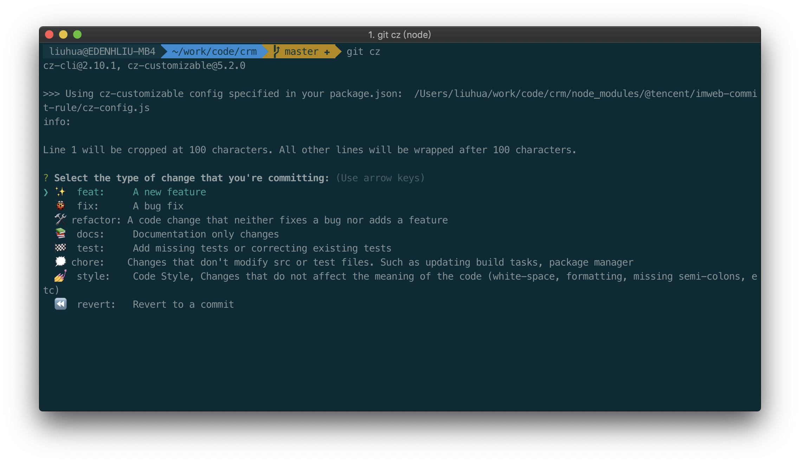
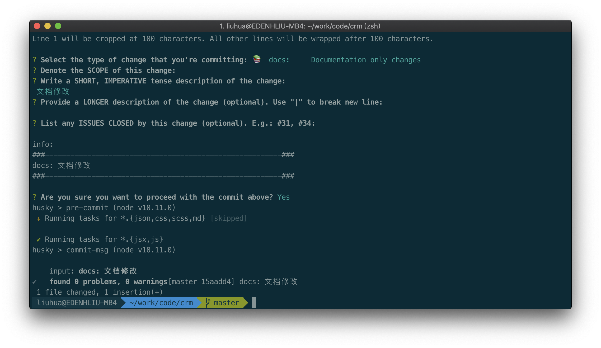

# A8K 项目 git 提交规范

提供了 commit 信息格式检测统一格式、交互式信息录入，简化接入该能力流程。

## 使用方式

### 安装包

```bash
# 安装依赖
npm i -D @a8k/changelog commitizen @commitlint/cli cz-customizable commitlint-config-cz
# 安装全局工具可以使用：git cz 命令提交代码
npm i -g commitizen
```

修改 package.json

> 包安装完毕会自动初始化配置，**无需手动添加任何配置**，如果你已经做了一些配置，插件不会覆盖，因此需要手动配置。

```json
+  "husky": {
+    "hooks": {
+      "commit-msg": "commitlint -E HUSKY_GIT_PARAMS",
+    }
+  },
```

### 例子

git commit

```shell
git commit -m 'feat(utils): 添加参数查询方法'
```

基于交互式命令行输入`git cz`

> 注意：需要安装`npm i -g commitizen`

```shell
git cz
```

出现选择 type 界面


根据提示输入完成 commit 信息


## 关于 Commit message 的格式

每次提交，Commit message 都包括三个部分：Header，Body 和 Footer。

```text
<type>(<scope>): <subject>
// 空一行
<body>
// 空一行
<footer>
```

其中，Header 是必需的，Body 和 Footer 可以省略。

不管是哪一个部分，任何一行都不得超过 72 个字符（或 100 个字符）。这是为了避免自动换行影响美观。

### Header

Header 部分只有一行，包括三个字段：type（必需）、scope（可选）和 subject（必需）。

**type**

type 用于说明 commit 的类别，只允许使用下面 8 个标识。

- feat：新功能（feature）
- fix：修补 bug
- docs：文档（documentation）
- style： 格式（不影响代码运行的变动）
- refactor：重构（即不是新增功能，也不是修改 bug 的代码变动）
- test：增加测试
- chore：构建过程或辅助工具的变动
- revert: 回滚代码到历史提交

> 如果 type 为 feat 和 fix，则该 commit 将肯定出现在 Change log 之中。其他情况可以不用放入

**scope**

scope 用于说明 commit 影响的范围，比如公共组件、页面、模块，工具等等，视项目不同而不同。

**subject**

subject 是 commit 目的的简短描述，不超过 50 个字符。

### Body

Body 部分是对本次 commit 的详细描述，可以分成多行。例如：

- 做修改的必要性
- 如何解决问题的
- 影响范围情况

### Footer

Footer 部分只用于两种情况。

> 不兼容变动

如果当前代码与上一个版本不兼容，则 Footer 部分以 BREAKING CHANGE 开头，后面是对变动的描述、以及变动理由和迁移方法。

> 关闭 Issue

如果当前 commit 针对某个 issue，那么可以在 Footer 部分关闭这个 issue: `Closes #4`

也可以同时关闭多个 issue: `Closes #5, #6, #7`

> 我们这里 issue 可以使用 tapd bug 的 id
